# WorkZoneWatch: Predict Traffic Delay Impact from Roadwork on I-10 in Phoenix, AZ

Team members: [Yanbing Wang](https://github.com/yanb514)


## Table of Content
- [Introduction](#introduction)
- [Dataset Generation](#dataset-generation)
- [Exploratory Data Analysis](#exploratory-data-analysis)
- [Modeling Approach](#modeling-approach)
- [Results](#results)
- [Future Work](#future-work)
- [Quick Start](#quick-start)
- [Description of Repository](#description-of-repository)

### Introduction
Phoenix’s Interstate 10 Broadway Curve is one of Arizona’s busiest freeway corridors, and its 11-mile segment recently underwent a four-year [reconstruction project](https://azdot.gov/i-10-broadway-curve-project) involving major lane closures between Loop 202 and I-17. *WorkZoneWatch* aims to quantify and predict the short-term delay impacts of planned roadwork and unplanned incidents along this corridor to support ADOT’s construction scheduling and traffic management decisions. Using INRIX historical speed data and AZ511 work zone and incident reports, we built an augmented dataset incorporating road geometry, traffic periodicity, and lagged travel-time features, and tested a suite of models to predict segment-level travel times. A counterfactual analysis was then performed by removing event-influenced data and event-related features to estimate “no-event” conditions, which serve as a baseline for quantifying delay caused by roadwork. Results show that planned events induce measurable but lagged delays—up to 15 seconds per mile (~3 minutes across the 11-mile segment)—roughly double routine congestion levels. Delays are most disruptive during weekday early afternoons and weekend mornings. These findings highlight opportunities to optimize work-zone scheduling and underscore the need for more complete and timely event reporting.

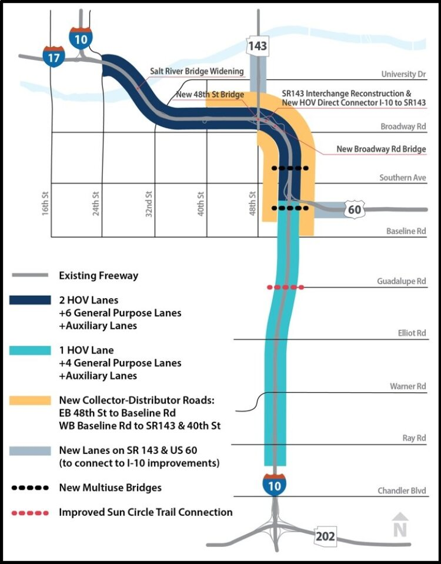
*Study Area: I-10 Broadway Curve: 11-mile stretch between Loop 202 and I-17 (source: ADOT)*

## Dataset Generation

Our dataset integrates **AZ511 event reports** and **INRIX historical traffic speed data** to quantify the delay impact of roadwork on the I-10 Broadway Curve corridor. These two datasets are combined through spatial and temporal matching to produce a unified, segment-level time series of traffic and event activity.

- [AZ511 Events Report](https://az511.com/api/wzdx):The AZ511 Traveler Information Platform provides event-based data on scheduled work zones and unplanned incidents across Arizona through the WZDx API. Since June 2025, we have developed and maintained an automated data pipeline that collects 48,109 event records every three hours via API requests and stores them in a local SQLite database for ongoing analysis. Each record includes attributes such as location, direction, timing, and severity following the WZDx specification. To integrate this information with traffic data, we performed geolocation by mapping 474 events on I-10 using their latitude–longitude coordinates to the nearest INRIX Traffic Messaging Center (TMC) segments in both travel directions, creating a spatially aligned event dataset for the I-10 Broadway Curve corridor.

- [INRIX Historic Traffic Speed Data](https://inrix.com/products/ai-traffic/): INRIX provides minute-level observations of vehicle speed, free-flow speed, and travel time for individual TMC segments derived from floating-car GPS data. The dataset spans September 2024–October 2025 and covers 50 TMC segments along I-10. Missing observations were interpolated using temporal smoothing, and duplicate segments were removed. The time range was aligned with AZ511 event records (June–October 2025). Both event and speed data were then synchronized and aggregated into uniform one-hour intervals. This data is accessed through a paid license.

The final dataset forms a 3D tensor with dimensions (50 TMC segments × 2,374 time bins × 20 features). Augmented features include road geometry (segment length, ramps, curvature), cyclic time variables (hour of day and day of week), lagged travel time, and synchronized planned and unplanned events with their subtypes and durations. The dataset is highly imbalanced, with only 0.87% of {tmc, time_bin} entries containing any event information. The enriched hourly dataset is stored at `/database/i10-broadway/X_full_1h.parquet`, and the segment-level travel time can be visualized below.

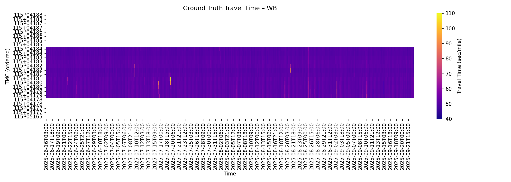
*Travel time heatmap by segments on Westbound I-10 Broadway Curve from June-October 2025.*

## Exploratory Data Analysis
Our exploratory analysis confirms the reliability of INRIX traffic data, but found some reporting issues with the AZ511 event data. Feature importance analysis is also attached.

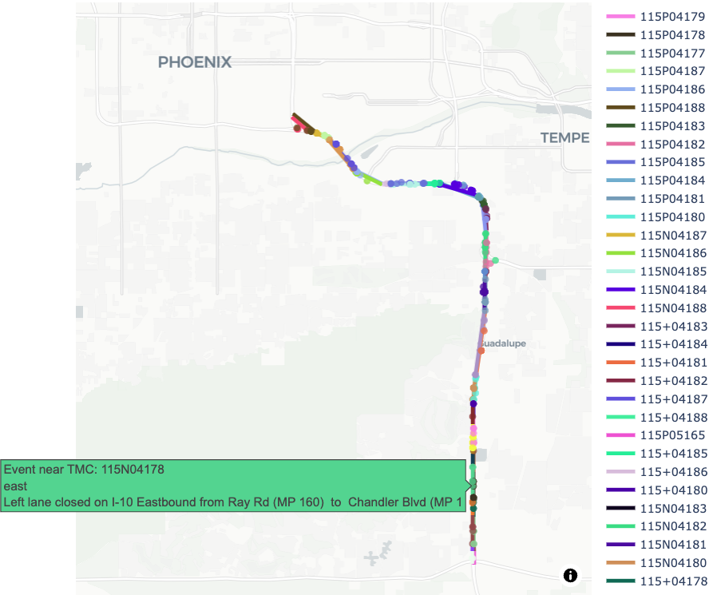
*Spatial matching of AZ511 events to TMC segments along the I-10 Broadway Curve. Each color represents a unique TMC segment.*

#### Traffic pattern
 We see no major issue with INRIX data. Traffic patterns are clear: Weekday traffic shows morning and afternoon slowdowns corresponding to commuter peaks, while weekends maintain consistently higher speeds throughout the day. Seasonally, average speeds are lower during the winter months (due to increased travel demand from seasonal visitors) and higher during the summer, when overall traffic volumes are lighter.

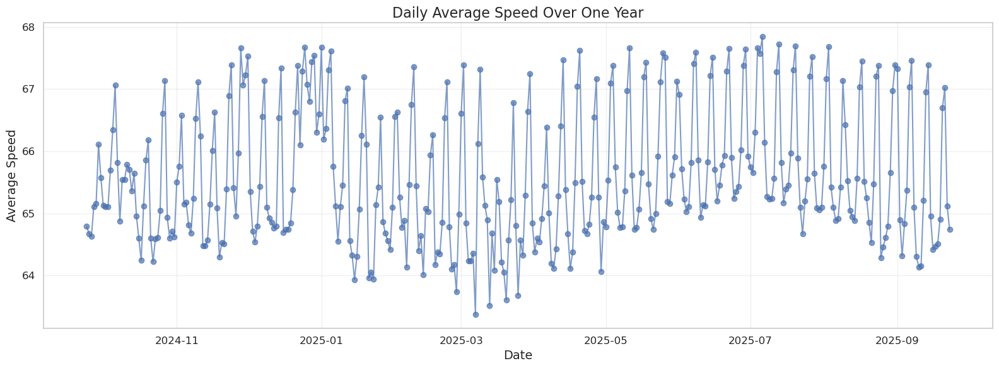
*Daily average traffic speed along the I-10 Broadway Curve over one year.*

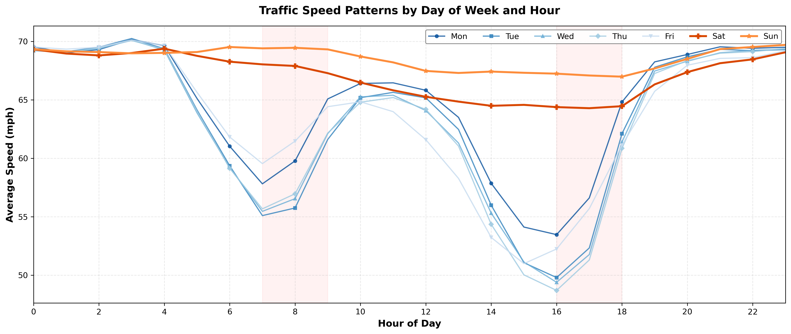
*Average traffic speed by day of week and hour. Weekdays (blue) show clear morning and evening rush hour dips, while weekends (orange) maintain higher speeds throughout the day.*

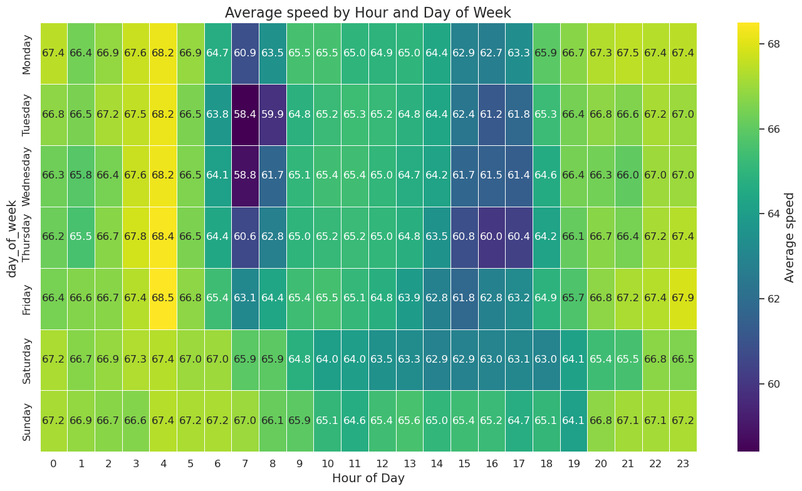
*Average traffic speed (mph) by hour and day of week shown as a heatmap.*

#### Event reporting issue
Upon reviewing AZ511 event records, we found that updates appear to occur in batch intervals of ~3 hours, and unplanned events are significantly underreported. Several crashes reported in local news were missing from AZ511, which suggests gaps in real-time data capture.

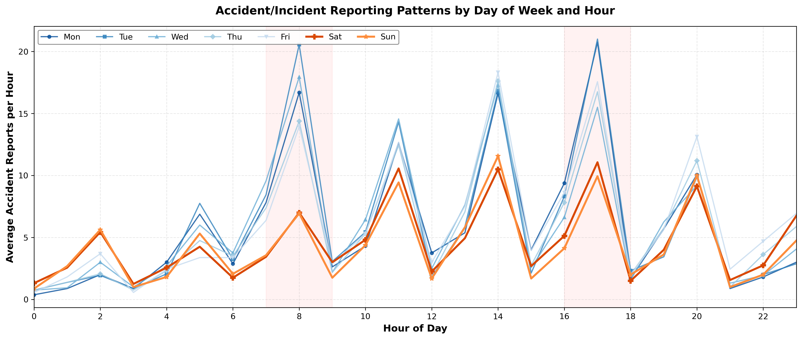
*Accident/incident reporting patterns by day of week and hour. Clear spikes at 8am, 11am, 2pm, 5pm, and 8pm suggest batch reporting at ~3-hour intervals. Weekdays (blue) show significantly higher reporting than weekends (orange), with Friday evening having the highest peak. The 5pm peak (evening rush hour) is the most prominent across all weekdays.*

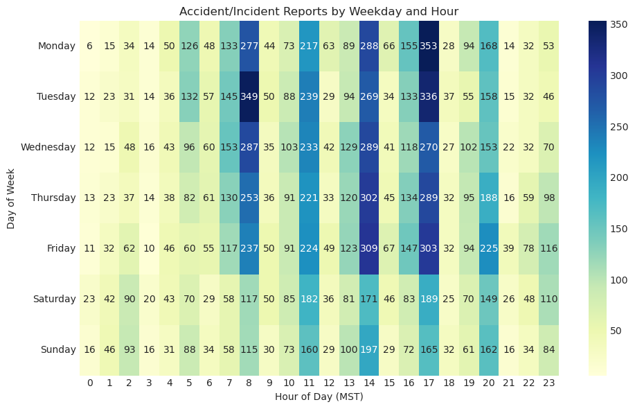
*Count of all events aggregated by day of week and hour of day shown as a heatmap*

While some event descriptions contain detailed narratives, the EventSubType field is inconsistently defined, with vague or nonstandard entries (e.g., C34Rshoulder instead of "Crash on right shoulder," and undefined codes such as T1018). Furthermore, the Severity field is missing in roughly 62% of records, limiting its usefulness for feature engineering. To ensure analytical consistency, we manually reclassified events into two categories—planned (e.g., work zones, closures) and unplanned (e.g., crashes, incidents)—based on their subtype descriptions.

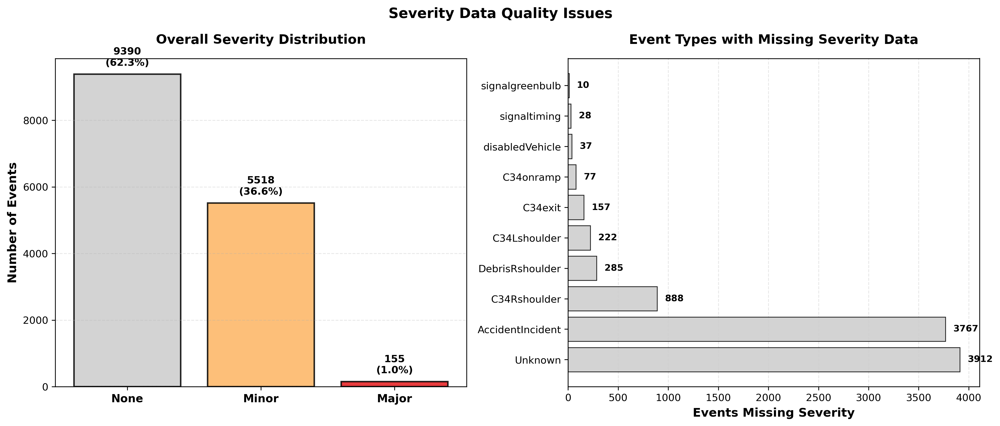

*Severity data quality issues: 62.3% of events have no severity assigned. The top two event types ("Unknown" and "AccidentIncident") have no severity information at all, while specific crash types (right shoulder, accidents) mostly have Minor severity assigned.*

#### Feature Importance
In addition, we explored feature importance by fitting an XGBoost model (see [Modeling Approach](#modeling-approach)). Results show that lagged travel-time (up to 3 hours) features dominate model performance (43.8%), followed by time-of-day patterns (23.6%). Event-related features contribute 15.9% - while this seems low, it reflects that events are rare (< 1% of hours). When events do occur, they have significant impact (shown in counterfactual analysis). The relatively low importance also suggests event reporting may not be in sync with the resulting traffic patterns.

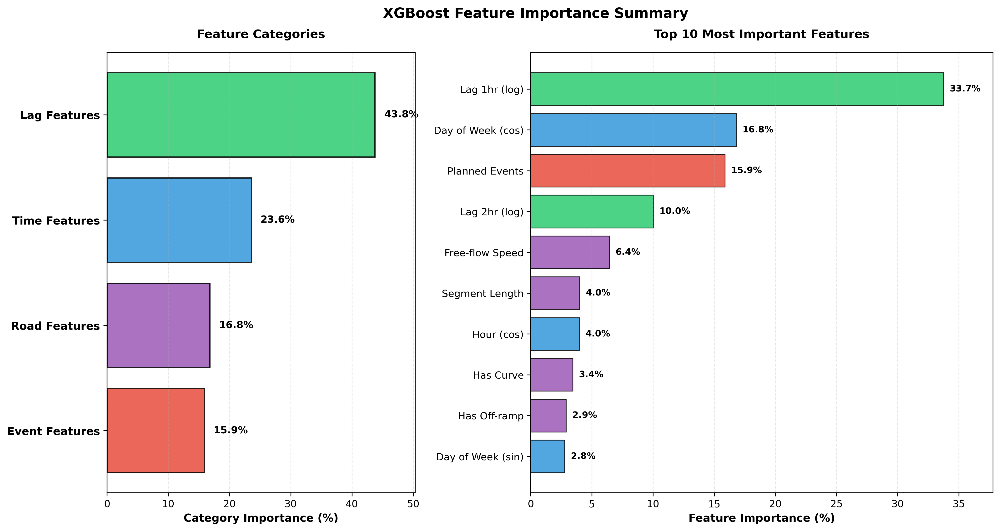
*Feature importance identified by XGBoost. Left: Category-level importance shows lag features dominate. Right: Individual features reveal that the most recent hour (Lag 1hr) alone accounts for 33.7% of predictive power.*


## Modeling Approach
We trained two classes of models based on their treatment of spatial and temporal dependencies. Tabular regression models—including Linear Regression and Tree-Based models—were trained on independent {tmc, time_bin} entries without explicit spatial or temporal structure. In contrast, sequence models such as Long Short-Term Memory (LSTM) and Graph Convolutional Network LSTM (GCN-LSTM) were designed to capture temporal continuity and, in the case of GCN-LSTM, spatial correlations between connected TMC segments. We then compare the traditional regression baselines with the deep learning models.

The best-performing model and feature combination were selected to conduct a counterfactual analysis, enabling estimation of event-induced delay in the absence of a direct control group (i.e., no-event conditions). Specifically, the control scenario was modeled by removing all data within ±3 hours of reported event times and excluding event-related and lag features that could be influenced by those events. Because this process disrupts temporal continuity, sequence models were not used, as they require complete, continuous time-series data for training.

### Model Overview
|Model Class| Model Family | Description | Training Data
|----|----------|-------------|-------------|
|Tabular regression models | **Linear Regression** | Ordinary Least Squares (OLS), Ridge and Lasso. Assume linear relationships between events, time features, and travel time. No interaction terms. No spatial or temporal dependency.| Event-balanced data points[^1] |
|Tabular regression models | **Tree-Based Models** | Random Forest (rf), Gradient Boosted Regression Trees (gbrf) and XGBoost. Captures nonlinearities and interactions, No spatial or temporal dependency.|Event-balanced data points[^1] |
|Sequence models | **LSTM** | A recurrent neural network for time-series prediction. A global (pooled) model trained on all TMC time-series sliced into short 24-hr sequences. Consider temporal but no spatial dependency.| Sliced short sequences across all TMCs |
|Sequence models| **GCN-LSTM** | A spatial-temporal graph neural network (ST-GNN) model. GCN captures spatial dependencies between conneted TMCs, and LSTM learns temporal dynamics| Sliced short sequences across all TMCs |
<!-- | **SARIMAX Models** | Seasonal ARIMA with Exogenous Regressors. Models serial dependence and seasonality directly, trained independently for each TMC. Computationally heavy. Consider temporal but no spatial dependency. | Full time-series for each TMC | -->

[^1]: The training data is a multi-index DataFrame with indices {tmc, time_bin}, where events are counted at each entry. Since events occur in less than 1% of 1-hr time bins, we downsample non-event entries to achieve approximately 50% event balance in the training data.

### Feature choices
| Features | Description | Used By |
|----------|-------------|---------|
| **Road**  `(miles, on/off ramps, curve)`| Static features related to road geometry each TMC. Some are manually tagged from Google Satellite View | All models |
| **Events (evt)**  `(evt_cat_planned, evt_cat_unplanned)`| Counts or presence of planned events (closures, roadwork, etc.) and unplanned events (crashes, debris, accidents etc.)| All models |
|**Cyclic time (cyc)** `(hour_sin, hour_cos, dow_sin, dow_cos, hour_of_week_sin, hour_of_week_cos, is_weekend)`|Encodes daily & weekly periodicity| All models |
|**Lagged travel time (lag)** `(log_lag1_tt_per_mile, log_lag2_tt_per_mile, log_lag3_tt_per_mile)`|Explicit temporal features: travel time from 1-3 hours ago| **Tabular models ONLY** |
<!-- |**Seasonality** `(P,D,Q,s)`|Explicit periodic autocorrelation|SARIMAX only| -->

**Important:** Lag features are **excluded** from sequence models (LSTM, ST-GNN) because they process sequences of past timesteps directly. Including lag features would be redundant—the travel time from 1 hour ago is already present in the sequence at position t-1. This design choice prevents overfitting and allows each model type to use its optimal feature set.

**Tabular models** (XGBoost, RF, Linear):
- Full feature set: road + cyc + evt + **lag** (17 features)
- Lag features are **essential** for capturing temporal patterns

**Sequence models** (LSTM, ST-GNN):
- Full feature set: road + cyc + evt (14 features, **no lags**)
- Temporal patterns learned from sequence structure through recurrent states

For each model family in Tabular models, various regressor combinations were tested. The configurations include:
1. road features only
2. road + evt
3. road + evt + lag
4. road + lag
5. road + cyc
6. road + cyc + lag
7. full features: road + cyc + evt + lag


## Results

### Model training results

#### Understanding Feature Sets: Tabular vs Sequence Models

A critical distinction in model comparison is how different model types handle temporal information:

**Tabular Models** (XGBoost, Random Forest, Linear Regression):
- Process **one row at a time** with no concept of temporal order
- **Require explicit lag features** (lag1, lag2, lag3) to know past values
- Feature set: 17 features = time (7) + events (2) + **lags (3)** + road (5)

**Sequence Models** (LSTM, ST-GNN):
- Process **sequences of past timesteps** through recurrent architecture
- **Don't need explicit lag features** - past values already in sequence at positions t-1, t-2, t-3
- Feature set: 14 features = time (7) + events (2) + road (5) **(no lags)**

**Why This Matters:**

Including lag features in sequence models would be redundant—the travel time from 1 hour ago (lag1) is already present in the sequence at position t-1. This redundancy can lead to overfitting where the model over-relies on explicit lags instead of learning temporal patterns through its recurrent states.

**Empirical Validation:**

To verify this hypothesis, we can train LSTM with both configurations and compare:

```bash
# LSTM without lags (14 features) - recommended
python train_model_lstm.py --save-models --output-dir models/lstm_run

# LSTM with lags (17 features) - for comparison only
python train_model_lstm.py --include-lags --save-models --output-dir models/lstm_run_with_lags
```

Expected results based on sequence learning theory:
- **LSTM without lags**: ~6.5-6.6 RMSE (learns temporal patterns from sequence)
- **LSTM with lags**: ~6.5-6.6 RMSE (similar performance, lags are redundant)
- **Difference**: < 5% (proves lag features don't improve sequence models)

**Two Types of Comparison:**

1. **Direct Feature Comparison** (same 17 features):
   - LSTM with lags vs XGBoost with lags
   - Pure architecture comparison
   - Shows LSTM can match tabular models even with redundant features

2. **Best-Practice Comparison** (optimal features per model):
   - LSTM without lags (14 features) vs XGBoost with lags (17 features)
   - Real-world production comparison
   - Shown below (recommended)

#### Model Performance Comparison

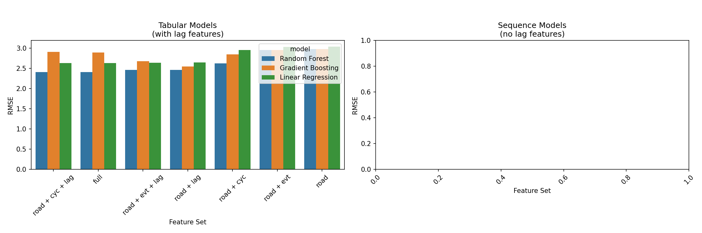

*Feature ablation study for tabular models.* Shows how adding different feature sets improves tabular model performance. Lag features provide the largest improvement (43.8% of XGBoost feature importance), confirming they are **essential** for tabular models to capture temporal patterns.

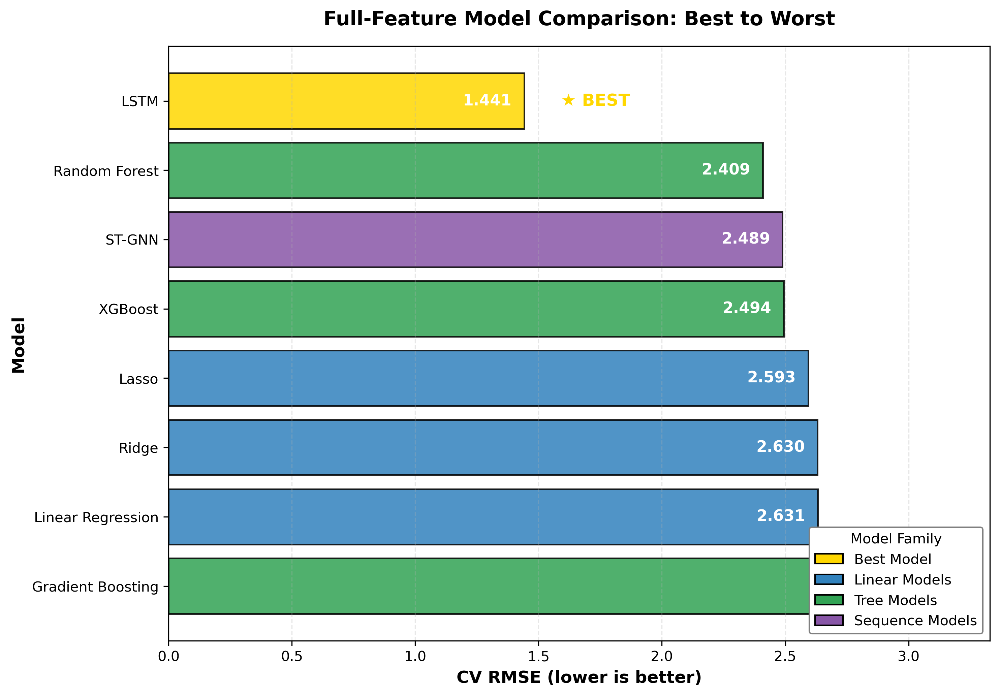

*Full-feature model comparison (best-practice configuration).* This chart shows each model using its **optimal feature set**:
- **Tabular models** (Linear, Ridge, Lasso, RF, XGBoost, GBRT): 17 features with explicit lags
- **Sequence models** (LSTM, ST-GNN): 14 features without explicit lags

The ST-GNN (GCN-LSTM) achieves the best performance by combining:
- Spatial learning (GCN captures relationships between connected road segments)
- Temporal learning (LSTM captures patterns across time)
- No feature engineering needed (learns from raw temporal sequences)

The following travel-time heatmaps visualize the model prediction results using optimal feature sets:
- **XGBoost**: 17 features including lag features (tabular model)
- **LSTM**: 14 features excluding lag features (sequence model)

<!-- 
*True travel time heatmap* -->

<!-- 
*Linear Regression with full features*


*Gradient boosted tree with full features* -->

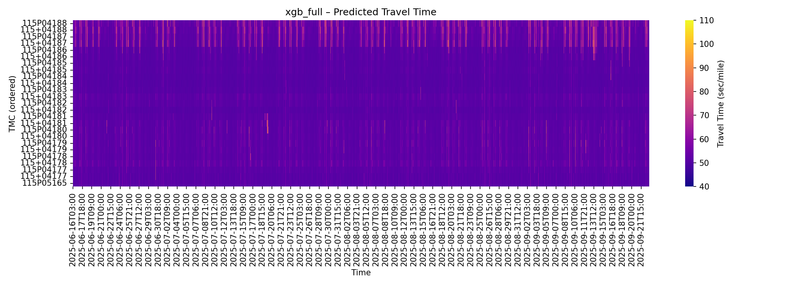
*XGBoost model with 17 features (including lag features)*

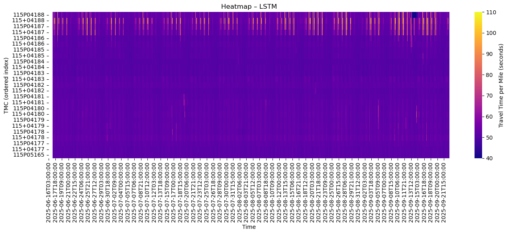
*LSTM model with 14 features (excluding lag features)*

<!-- 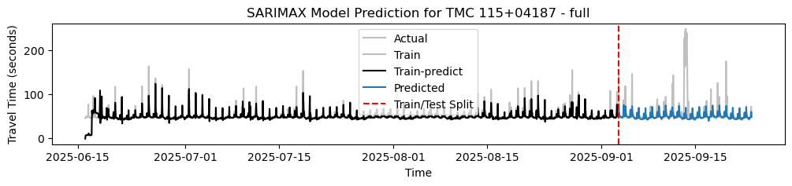
*SARIMAX model with full features* -->

<!-- 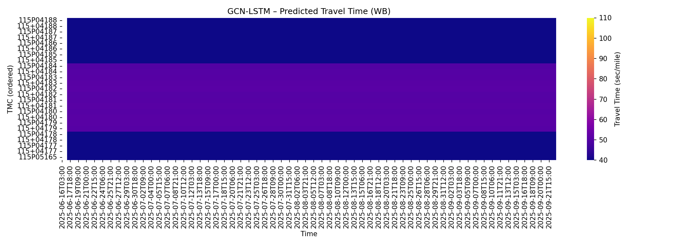
*GCN-LSTM predicted travel time heatmap* -->


**! Important Note:** All models are trained to make one-shot prediction, i.e., given current or some lagged states, predict the travel time in the next time_bin. They are not designed for multi-step or recursive forecasting.


### Event-induced delay
Event-induced delay was estimated using a counterfactual prediction model trained with XGBoost excluding all event-related data and features, allowing isolation of delay attributable to work zones and incidents. The analysis focused on planned events (e.g., roadwork), as they are typically longer in duration and less affected by underreporting.

The additional delay was computed as the difference between travel times predicted by the full model and the counterfactual “no-event” model. Results indicate that event-related delays peak during early afternoons (12–3 PM) on weekdays and in the mornings on weekends. While weekend or overnight closures—common DOT mitigation strategies—help reduce congestion, our findings show that these measures reduce but do not eliminate delays, particularly on weekends.

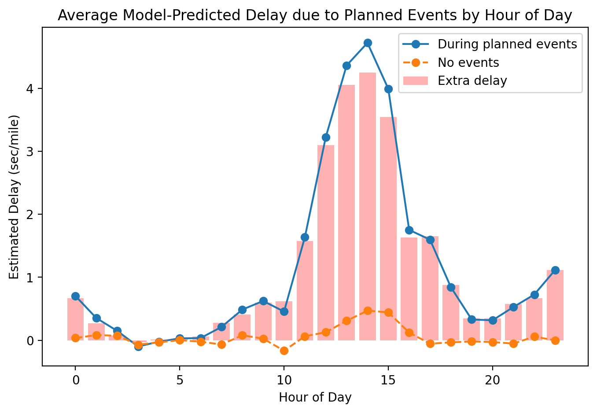

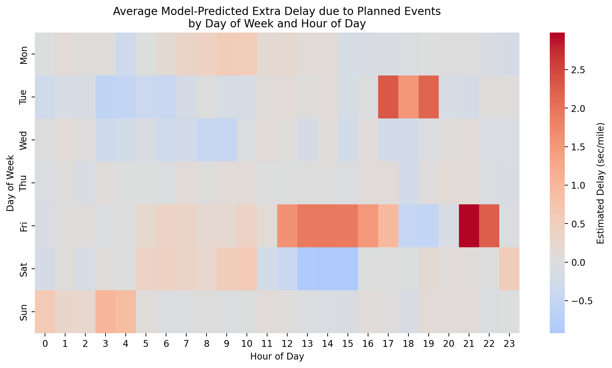

Further analysis reveals that planned work zones cause prolonged, lagged effects, with delays peaking 3–5 hours after work begins and reaching up to 15 sec/mile (2-3min extra delay on the 11-mile corridor), which doubles the typical daily congestion delay.

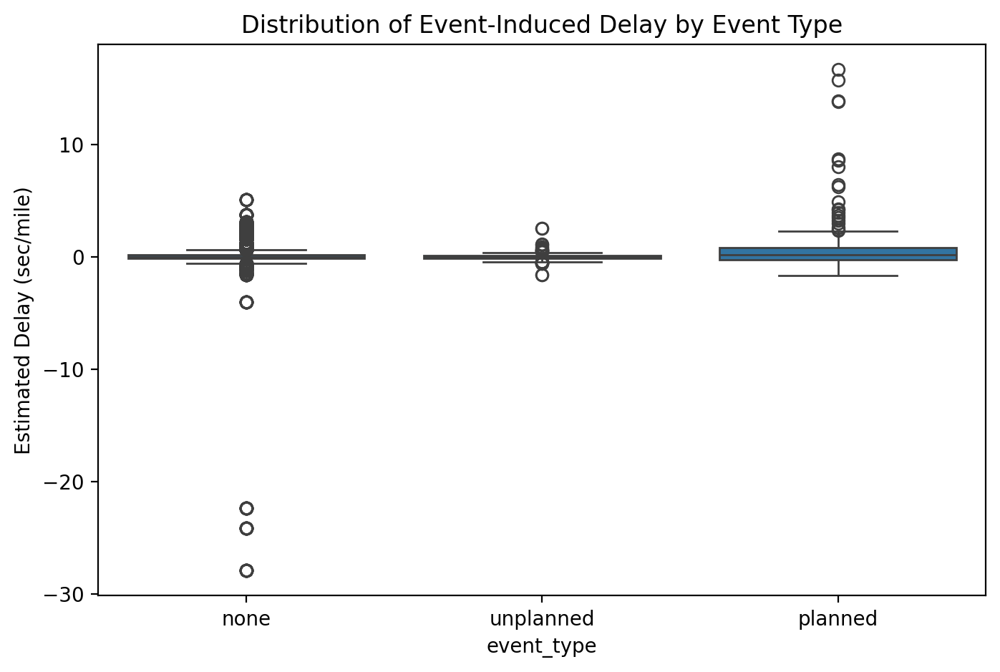

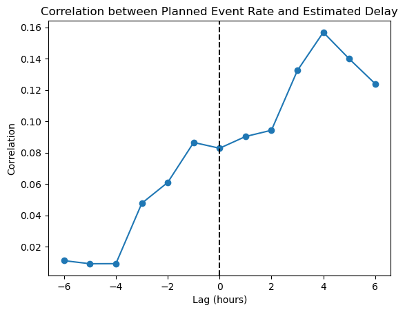

These results are consistent with ADOT’s observations that off-peak closures lessen congestion but cannot eliminate it entirely. The observed lagged and residual delays also underscore the need for more complete and timely event reporting to improve predictive accuracy and mitigation planning.

## Future Work
1. Integrate real-time incident feeds to address underreported and delayed event updates, such as  exploring connected vehicle data or roadside sensor information (e.g., CCTV camera).
2. Expand the feature context by incorporating weather conditions and detailed event descriptions.
3. Explore causal inference methods to rigorously estimate the delay impact attributable to multiple interacting factors such as work zones, demand fluctuations, and incidents.

## Quick Start

### Prerequisites
Before running the pipeline, make sure you have:
- **Environment set up**: Run `conda env create -f environment.yml && conda activate kafka`
- **AZ511 event data**: `database/az511.db` (created by running `python database/az511.py`)
- **INRIX traffic data**: Raw CSV files in `database/inrix-traffic-speed/I10-and-I17-1year/`
  - Required files: `I10-and-I17-1year.csv` and `TMC_Identification.csv`

### Optional: Generate All Visualizations
To recreate all visualizations shown in the EDA, modeling, and results sections:

```bash
# Generate ALL plots with one command
python generate_all_plots.py
# Output: All images in images/ directory

# Or generate only fast plots (skip slow data processing)
python generate_all_plots.py --skip-slow

# Or generate only specific plot types
python generate_all_plots.py --only MODEL_COMP      # Model comparison charts
python generate_all_plots.py --only TRAVEL_TIME     # Travel time predictions
python generate_all_plots.py --only EVENT_IMPACT    # Event impact analysis
```

This master script generates all visualizations used in the README:
- **Day-of-week patterns**: Speed and accident reporting by hour and day
- **Model comparisons**: Feature ablation, full-feature comparisons, heatmaps
- **Travel time predictions**: Side-by-side comparisons, error analysis
- **Event impact**: Delay analysis, correlation plots, heatmaps


### Running the Full Pipeline

The complete workflow consists of five steps that build on each other:

```bash
# Step 1: Prepare the training dataset
# Combines AZ511 events with INRIX traffic data, assigns events to road segments (TMCs),
# creates time-binned features, and outputs a clean parquet file
python prepare_i10_training_data.py
# Output: database/i10-broadway/X_full_1h.parquet

# Step 2: Train tabular baseline models
# Fits Linear Regression, Ridge, Lasso, Random Forest, Gradient Boosting, and XGBoost
python train_model_tabular.py --save-models
# Output: models/tabular_run/ (contains trained models + metrics)

# Step 3: Train LSTM sequence model
# Uses time-series slices to capture temporal dependencies
python train_model_lstm.py --save-models
# Output: models/lstm_run/

# Step 4: Train GCN-LSTM spatial-temporal model
# Combines Graph Convolutional Network (captures spatial relationships between TMCs)
# with LSTM (captures temporal patterns)
python train_model_stgnn.py
# Output: models/gcn/gcn_lstm_i10_wb/


# Step 5: Generate all visualizations
# Master script that generates ALL plots shown in README
python generate_all_plots.py
# Output: images/ (all plots including heatmaps, RMSE charts, delay analysis, etc.)
#
# Alternative: Generate only fast plots (skip day-of-week and event impact)
# python generate_all_plots.py --skip-slow
#
# Alternative: Generate specific plot types
# python generate_all_plots.py --only MODEL_COMP
# python generate_all_plots.py --only EVENT_IMPACT
```

## How It Works: Step-by-Step Workflow

### Data Collection Phase

**Collect AZ511 Events** (run periodically, e.g., every 3 hours)
```bash
python database/az511.py
```
- Fetches current roadwork, accidents, closures, and incidents from AZ511 API
- Stores in `database/az511.db` (SQLite)
- Updates existing events or inserts new ones based on event ID
- Timestamps stored as Unix epoch integers

**Collect WZDx Work Zones** (optional, for WZDx-format data)
```bash
python database/wzdx.py
```
- Fetches work zone data in WZDx (Work Zone Data Exchange) format
- Stores in `database/workzones.db` with three tables:
  - `work_zones`: All work zone events
  - `accidents`: Filtered accident events
  - `daily_counts`: Cached daily aggregations
- Uses "lazy update" for counts (only recalculates when dashboard requests data)

### Data Preparation Phase

**Step 1: Prepare Training Data** (`prepare_i10_training_data.py`)

This script does the heavy lifting to create a clean, ML-ready dataset:

1. **Load Events from Database**
   - Reads `database/az511.db`
   - Filters to I-10 Broadway Curve area (lat/lon bounding box)
   - Converts Unix epoch timestamps to datetime

2. **Load INRIX Traffic Data**
   - Reads large CSV files with minute-level speed observations
   - Filters to TMC segments within Broadway Curve
   - Each TMC is a road segment with unique ID, direction, and length

3. **Match Events to Road Segments**
   - Uses geometric distance calculations to assign each event to nearest TMC
   - Direction-aware: matches eastbound events to eastbound TMCs
   - Fallback for unknown directions

4. **Time Binning and Aggregation**
   - Aggregates INRIX data from minute-level to hourly bins
   - Creates MultiIndex: `(tmc_code, time_bin)`

5. **Feature Engineering**
   - **Cyclic time features**: Encode hour/day patterns (sin/cos transforms)
   - **Event features**: Count of planned vs unplanned events per TMC per hour
   - **Lag features**: Previous 1-3 hours of travel time (captures momentum)
   - **Road geometry**: Segment length, on/off ramps, curves (manual tags)

6. **Output**
   - `X_full_1h.parquet`: Main training data with all features
   - Optional: `events.parquet`, `inrix.parquet`, `tmc.parquet` for inspection

### Model Training Phase

**Step 2-4: Train Models**

Each training script follows this pattern:
1. Load `X_full_1h.parquet`
2. Split data chronologically (train on earlier months, test on later months)
3. Balance training data (downsample non-event rows since events are rare <1%)
4. Train model(s)
5. Evaluate with RMSE, MAE, R² on test set
6. Save trained models and metrics

**Model Types:**
- **Tabular**: Treat each `(TMC, time)` pair independently, use standard regression
- **LSTM**: Slice data into sequences, capture temporal dependencies
- **GCN-LSTM**: Add spatial graph structure (TMCs connected by road network)

**Step 5: Generate All Visualizations**

The master script `generate_all_plots.py` orchestrates all visualization generation:

1. **Day-of-week patterns**: Traffic speed and accident reporting patterns by hour and day
2. **Model comparison**: Feature ablation studies, full-feature comparisons, RMSE heatmaps
3. **Travel time predictions**: Side-by-side truth vs prediction, error analysis by time/segment
4. **Event impact analysis**: Counterfactual delay estimation
5. **Comparison heatmaps**: Time × TMC heatmaps for all models

The script provides flexible options:
- Generate all plots: `python generate_all_plots.py`
- Skip slow plots: `python generate_all_plots.py --skip-slow`
- Generate specific types: `python generate_all_plots.py --only MODEL_COMP`

All outputs are saved to `images/` directory.

**Event Impact Analysis (included in Step 5)**

Uses a counterfactual approach:
1. Train "full" model with all features (including events)
2. Train "no-event" model without event data/features
3. Predict travel time for same inputs using both models
4. Difference = estimated delay caused by events

Results show planned roadwork adds 10-15 sec/mile delay, with lagged effects 3-5 hours after work begins.

## Key Concepts

### TMC (Traffic Message Channel)
A TMC is a road segment with a unique identifier used by INRIX. Each TMC represents a stretch of highway with:
- Start and end coordinates (lat/lon)
- Direction of travel (eastbound/westbound)
- Length in miles
- Reference speed (free-flow speed)

The I-10 Broadway Curve has 50 TMC segments (25 per direction).

### Time Binning
Traffic data is aggregated into hourly bins. For example:
- Raw INRIX data: minute-level observations (speed, travel time)
- After binning: hourly averages (one row per TMC per hour)

This creates a MultiIndex DataFrame: `(tmc_code, time_bin)` where each row represents one TMC segment during one hour.

### Event Categories
Events from AZ511 are classified into two main groups:
- **Planned events**: Roadwork, scheduled closures, shoulder work
- **Unplanned events**: Crashes, debris, accidents, incidents

The model uses these categories as binary features (event present/absent in each time bin).

### Lag Features
Travel time from previous hours (lag1, lag2, lag3). These are powerful predictors because traffic has momentum - if it's slow now, it's likely to stay slow for the next hour.

### Counterfactual Analysis
A method to estimate causal impact:
1. Train a model that includes event information → predicts travel time with events
2. Train a model without event information → predicts travel time as if no events occurred
3. Difference between predictions = estimated delay caused by events

## Troubleshooting

**"No valid events data received from API"**
- Check your `AZ511_API_KEY` in `.env` file
- Verify internet connection
- Try manually visiting `https://az511.com/api/v2/get/event?key=YOUR_KEY&format=json`

**"File not found: az511.db"**
- Run `python database/az511.py` first to collect event data
- Make sure you're in the project root directory when running scripts

**"KeyError: 'tmc_code'" or missing INRIX data**
- Ensure INRIX CSV files are in `database/inrix-traffic-speed/I10-and-I17-1year/`
- Check that `TMC_Identification.csv` and `I10-and-I17-1year.csv` both exist
- INRIX data is proprietary and not included in this repo

**XGBoost models skipped**
- Install xgboost: `pip install xgboost` or use conda environment
- Models will automatically skip if xgboost is not available

**Out of memory errors**
- INRIX data is large (several GB). Reduce date range in `prepare_i10_training_data.py`
- Use `--interval 2h` or `--interval 4h` for coarser time bins
- Close other applications to free up RAM


<!-- ## Data Dashboard

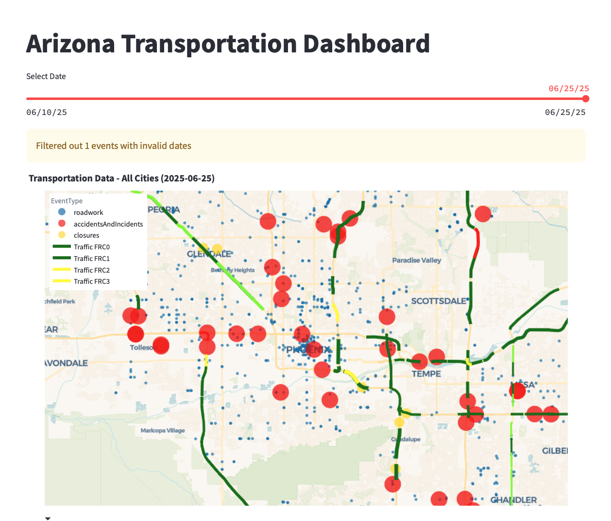
*Interactive map showing AZ511 work zones and traffic data across Arizona*

- **AZ511 Work Zone Monitoring**
  - Real-time work zone events
  - Construction and incident tracking
  - Geographic distribution analysis
  - Duration and timing analytics


- **Interactive Visualizations**
  - Combined map view with work zones and traffic flow
  - City-based filtering (Phoenix, Tucson, Flagstaff, Gilbert, Yuma)
  - Date range selection
  - Event type distribution charts
  - Duration analysis histograms


## Dashboards
**Dashboard to visualize events and traffic**:
```bash
streamlit run dashboard/az511app.py
```

Dashboard Features:
- **Data Source Selection**: Toggle between AZ511 work zones and TomTom traffic flow
- **Geographic Filtering**: Filter by city (Phoenix, Tucson, Flagstaff, Gilbert, Yuma)
- **Date Selection**: View data for specific dates
- **Interactive Map**: 
  - AZ511 events shown as colored markers (by event type)
  - TomTom traffic flow displayed as colored polylines with 5-tier speed system:
    - Green: Excellent flow (90%+ free flow speed)
    - Light Green: Good flow (70-90%)
    - Yellow: Moderate flow (50-70%)
    - Orange: Slow flow (30-50%)
    - Red: Very slow/stopped (<30%)
  - Arizona road network overlay from GeoJSON files (interstates and state routes)
  - Functional Road Class (FRC) filtering with performance optimizations
  - Smart rendering limits for local roads (FRC4+ limited to 1000 segments)
  - Legend positioned on the right side of the map
- **Analytics Charts**: 
  - Event type distribution
  - Work zone duration analysis
  - Update vs start date patterns

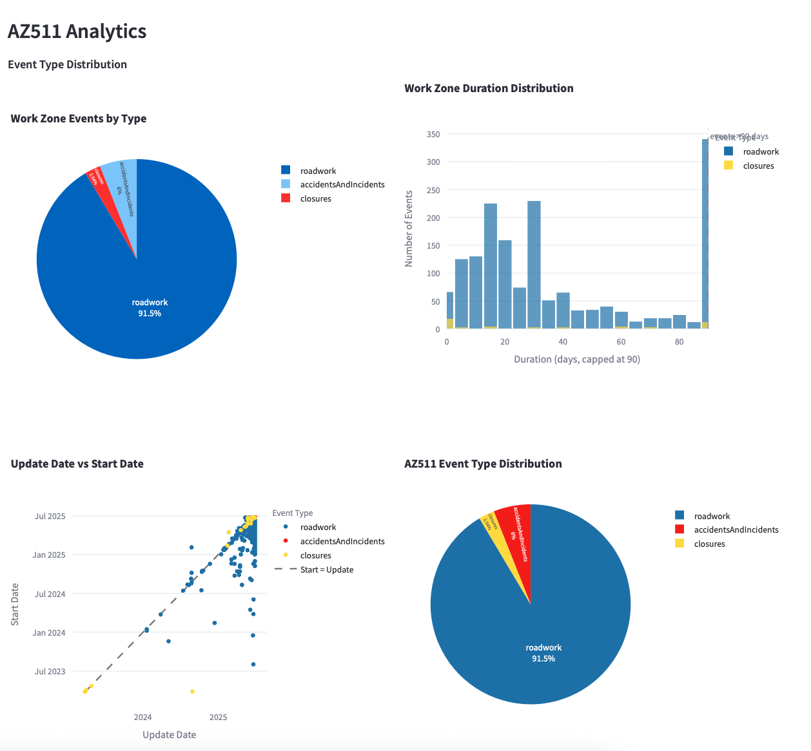
*Comprehensive analytics including event distributions, duration analysis, and temporal patterns* -->

## Description of Repository
The project repository is organized as follows. 
```
wzdx/
├── environment.yml              # Conda environment specification
├── requirements.txt             # Python dependencies (pip)
├── run_az511.sh                 # Shell script to run AZ511 job
├── README.md                    # Project documentation
├── _log/                        # Logs from data collection
│   └── az511_28538440.err
├── dashboard/                   # Streamlit dashboard applications
│   ├── az511app.py              # AZ511 work zone + traffic dashboard
│   ├── inrixapp.py              # INRIX-specific dashboard
│   ├── wzdxapp.py               # WZDx-focused dashboard
│   └── __pycache__/             # Bytecode cache
├── database/                    # Data files, scripts, and assets
│   ├── az511.py                 # AZ511 data collection script
│   ├── az511.db                 # AZ511 data
│   ├── wzdx.py                  # Work zone data processing script
│   ├── i10-broadway/            # Processed training data
│   │   ├── X_tensor_1h.npz
│   └── inrix-traffic-speed/     # Raw data from INRIX (not shared)
│       └── I10-and-I17-1year/
│           ├── Contents.txt
│           ├── I10-and-I17-1year.csv
│           └── TMC_Identification.csv
├── images/                      # Figures for README and dashboards
├── models/                      # Model training output
│   └── gcn/                     # Training results for GCN-LSTM
│   └── lstm_run/                # Training results for LSTM
│   └── tabular_run/             # Training results for LR and Tree-based models using tabular data
├── notebooks/                   # EDA and adhoc scripts
├── src/                         # Generic helper utilities
├── generate_all_plots.py        # Master script to generate ALL visualizations
├── visualization_utils.py       # Shared utilities for plotting (colors, markers, styles)
├── create_day_of_week_viz.py    # Generate day-of-week patterns (speed + accidents)
├── create_model_comparison_viz.py  # Generate model comparison charts
├── create_travel_time_viz.py    # Generate travel time prediction visualizations
├── evt_impact_analysis.py       # Event impact counterfactual analysis
├── model_comparison.py          # Comprehensive model comparison with heatmaps
├── manage.py                    # CLI wrapper for common operations
├── prepare_i10_training_data.py # Prepare the dataset (events + INRIX → parquet)
├── train_model_lstm.py          # Train LSTM sequence model
├── train_model_stgnn.py         # Train ST-GNN (GCN-LSTM) spatial-temporal model
└── train_model_tabular.py       # Train tabular baselines (Linear/Ridge/Lasso, RF/GBRT, XGBoost)
```

<!-- ## Data Access

This project uses a combination of proprietary and public datasets:

- **INRIX data** — Licensed and proprietary. The raw data cannot be shared due to contractual restrictions.  
  However, **processed and aggregated training data** (e.g., anonymized feature tables, model inputs, or summary statistics) can be shared upon reasonable request.  

- **AZ511 data** — Publicly available through the [Arizona Department of Transportation (ADOT) 511 API](https://www.az511.com/).  
  You can access it directly by registering for an API key or using their open endpoints.

Processed datasets and derived features included in this repository are shared under the same license as the code (MIT), unless otherwise noted.

For questions or data-sharing inquiries, please contact
**Yanbing Wang**  -->

## License
MIT License

Copyright (c) 2025 Yanbing Wang

Permission is hereby granted, free of charge, to any person obtaining a copy
of this software and associated documentation files (the "Software"), to deal
in the Software without restriction, including without limitation the rights
to use, copy, modify, merge, publish, distribute, sublicense, and/or sell
copies of the Software, and to permit persons to whom the Software is
furnished to do so, subject to the following conditions:

The above copyright notice and this permission notice shall be included in
all copies or substantial portions of the Software.

THE SOFTWARE IS PROVIDED "AS IS", WITHOUT WARRANTY OF ANY KIND, EXPRESS OR
IMPLIED, INCLUDING BUT NOT LIMITED TO THE WARRANTIES OF MERCHANTABILITY,
FITNESS FOR A PARTICULAR PURPOSE AND NONINFRINGEMENT. IN NO EVENT SHALL THE
AUTHORS OR COPYRIGHT HOLDERS BE LIABLE FOR ANY CLAIM, DAMAGES OR OTHER
LIABILITY, WHETHER IN AN ACTION OF CONTRACT, TORT OR OTHERWISE, ARISING FROM,
OUT OF OR IN CONNECTION WITH THE SOFTWARE OR THE USE OR OTHER DEALINGS IN
THE SOFTWARE.